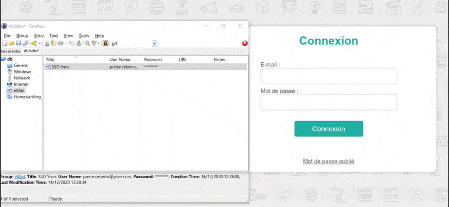
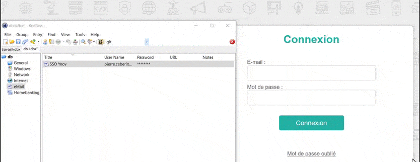

# TP2 : Attaques sur les mots de passe
## Mise en oeuvre et utilisation d'un gestionnaire de mots de passe

## Classe : B3B
## Élèves : Emma Durand **[@emmadrd912](https://github.com/emmadrd912)** et Pierre Ceberio **[@PierreYnov](https://github.com/PierreYnov)** 

# Sommaire 

- [Le Lab](#le-lab)
- [Découverte de l'outil](#d%C3%A9couverte-de-loutil)
- [Configuration et utilisation du gestionnaire de mot de passe](#configuration-et-utilisation-du-gestionnaire-de-mot-de-passe)
    - [I. Étapes préliminaire](#i-%C3%A9tapes-pr%C3%A9liminaire)
    - [II. Utilisation de l'outil](#ii-utilisation-de-loutil)
- [Fonctionnalités annexes du gestionnaire de mot de passe ](#fonctionnalit%C3%A9s-annexes-du-gestionnaire-de-mot-de-passe)
    - [I. Générateur de mots de passe](#i-g%C3%A9n%C3%A9rateur-de-mots-de-passe)
    - [II. Tâches automatisées](#ii-t%C3%A2ches-automatis%C3%A9es)
- [Sécurisation de la solution](#s%C3%A9curisation-de-la-solution)

## Le Lab

Logiciel [Keepass](https://keepass.info/)

## Découverte de l'outil

**Sous quelle forme sont stockés les mots de passe enregistrés dans le logiciel ?**

- Les mots de passe sont stockés dans une base de données.

**Quel algo sont utilise pour cela ?**

- AES/Rijndael, ChaCha20 (and with plugins: Twofish, Serpent, GOST, ...)

**Pourquoi l'ANSSI recommande la version 2.41 plutôt que la 1.36 ?**

C'est une version plus stable, des vulnérabilités ont été corrigées, dont une attaque par [MITM](https://www.cert.ssi.gouv.fr/actualite/CERTFR-2016-ACT-023/). Les hashs et les signatures pour le contrôle d’intégrité sont disponibles, et les binaires du programme sont signés numériquement (Authenticode). 

## Configuration et utilisation du gestionnaire de mot de passe 

### I. Étapes préliminaire 

    - créez un compte user sur votre poste : mot de passe fort + membre groupe admin

    - ouvrir Keepass et renseigner un master password d'au moins 15 caractères (grâce à  Méthode des premières lettres ou méthode phonétique.)

Je crée une nouvelle base de données :

Il m'est demandé de renseigner le Master Password :

J'utilise la méthode phonétique pour avoir un mot de passe fort que je puisse retenir, ici ma phrase est :

``C’est un fameux trois-mâts, Hisse et ho et J'ai acheté huit CD pour cent euros cet après-midi``

Ce qui me donne comme mot de passe :

``c1famE3ma,is&o&ght8CD%E7am``

### II. Utilisation de l'outil 

Je crée le compte admin dans la section Windows :

Je renseigne les informations puis sauvegarde

Je fais pareil dans la section mail pour mon compte Ynov.

Je me connecte au SSO de Ynov en copier-coller :

Je me connecte au SSO de Ynov en auto-type :

## Fonctionnalités annexes du gestionnaire de mot de passe 
### I. Générateur de mots de passe 

    - générer un nouveau master password de la db en utilisant le générateur, avec les contraintes de complexité vu plus haut

J'utilise le générateur pour générer un nouveau Master Password, avec 15 caractères minimum :

Voici le nouveau mot de passe : ``@:j1/oFt3lGjF;3``

### II. Tâches automatisées 

**Expliquer la fonctionnalité Triggers**
 
La fonction trigger permet de sauvegarder une base de données et de l'enregistrer dans un deuxième endroit.

    - créer un trigger pour sauvegarder automatiquement la base à la fermeture
    - il ne doit conserver que les 3 derniers exemplaires dans son historique

On va dans Trigger puis > **Add Trigger**

Dans Événements on choisit : **Sortie de l'application**

On va ensuite dans **Actions**, et on crée 2 actions :

- Mode : ``Executer la ligne de commande ou l'adresse (URL)``, Fichier/adresse(URL) : ``%comspec%`` , Arguments : ``/c copy "C:\Users\anony\Documents\my_keepass\perso.kdbx" "C:\Users\anony\Documents\testdb\test.kdbx.{DT_SIMPLE}``"

- Mode : ``Executer la ligne de commande ou l'adresse (URL)``, Fichier/adresse(URL) : ``%comspec%`` , Arguments : ``/c for /f "skip=3 tokens=*" %X in ('dir "C:\Users\anony\Documents\testdb\test.*" /b /o:-d') do del "C:\Users\anony\Documents\testdb\%X"``

A la fermeture de Keepass, le fichier sera sauvegardé et si il y a plus de 3 backups, ça supprimera la plus vieille.

## Sécurisation de la solution

**Imprimer une feuille d'urgence avec le master password**

La feuille d'urgence permet d'écrire notre Master password sur la feuille ainsi que certaines informations concernant la base de données et de la garder précieusement. 

Le script Robocopy pour sauvegarder la DB : 

